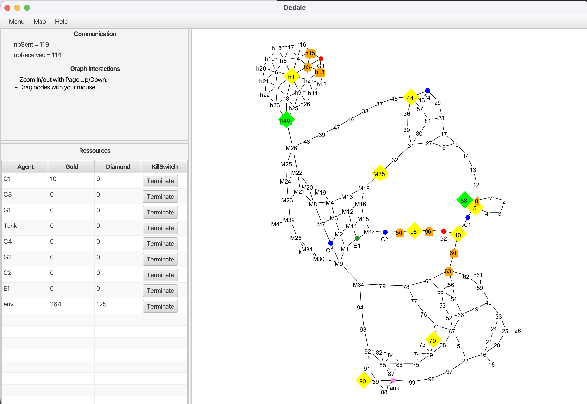

# Projet FoSyMa - Wumpus Multi-agent (Dedale / JADE)

Projet de **Fondements des Systèmes Multi-Agents (FoSyMa)** – M1 ANDROIDE 2024-2025.  
L’objectif est de développer en binôme une variante multi-agent du jeu _Hunt the Wumpus_ en utilisant la plateforme **JADE** et l’environnement **Dedale**.

---

## Objectifs du projet

- Modéliser et programmer un **système multi-agent coopératif**.
- Concevoir des **stratégies d’exploration collective** d’un environnement inconnu.
- Mettre en place des **mécanismes de coordination** pour la collecte de ressources.
- Gérer un **environnement dynamique** avec la présence d’un adversaire (Golem).
- Analyser les **performances** (communication, temps, complexité, robustesse).

---

## Description du jeu

L’environnement Dedale est composé de **noeuds** et d'**aretes** formant un **graphe général**.

Les agents n’en connaissent pas la topologie au départ et doivent :
- l’**explorer**,
- construire progressivement une **carte de l’environnement**,
- **collecter un maximum de trésors** (or et diamants) enfermés dans des coffres.

Un **Golem** (adversaire non agressif) se déplace dans la carte et :
- **déplace les trésors**, en en détruisant une partie à chaque fois,
- peut **refermer des coffres déjà ouverts**.

---

## Types d’agents

### Agent `silo`
- Capacité de stockage **illimitée**.
- Ne peut **pas** ramasser directement les ressources.
- Peut se déplacer et **communiquer** avec les autres agents.

### Agents `collecteurs`
- Possèdent un **sac à dos** de capacité limitée `M`.
- Peuvent **explorer**, **ouvrir des coffres** et **ramasser des trésors**.
- Ont deux types de **compétences** :
  - `lockpicking` (serrurerie) : ouverture des coffres ;
  - `strength` (force) : collecte effective du trésor.

Le ramassage d’un trésor :
- nécessite un certain nombre de points en **serrurerie** (pour ouvrir),
- et en **force** (pour collecter),
- s’effectue sur la case du coffre, en **mutualisant les compétences** des agents connectés,  
  mais **seul le sac à dos de l’agent sur le trésor est rempli**.

---

## erceptions & communications

### Perception locale
Depuis une pièce, un agent perçoit notamment :
- l’**ID unique** de la pièce ;
- les **connexions vers les noeuds voisines** ;
- la présence d’un **coffre** et ses propriétés ;
- les **agents voisins** ;
- une éventuelle **odeur d’adversaire** (Golem) sur les pièces adjacentes.

### Communication limitée
- Les communications se font par **messages** entre agents coopératifs.
- Le **rayon de communication est limité** (souvent 2 nœuds).
- Les protocoles doivent :
  - **supporter différents rayons**,
  - rester **parcimonieux en messages**,
  - être **robustes** à la structure de l’environnement.

---

## Fonctionnalités à implémenter

### 1. Exploration coopérative
- Construction d’une **carte partagée** de l’environnement.
- Évitement des **redondances de visite**.
- Stratégies de **répartition des zones à explorer** entre agents.

### 2. Partage d’information
- Amélioration du **partage de cartes** par rapport à la version de base fournie en TP.
- Réduction de la **taille des messages** et de la **fréquence d’échange**.
- Gestion de la **mise à jour incrémentale** de la connaissance.

### 3. Collecte efficace de trésors
- Choix des **cibles à prioriser** (proximité, quantité, compétences requises, risque Golem...).
- **Regroupement d’agents** pour satisfaire les contraintes de serrurerie et de force.
- Gestion de la **capacité du sac à dos** et des **allers-retours vers le silo**.

### 4. Gestion du Golem (environnement dynamique)
- Détection indirecte de sa présence (odeur, disparition/déplacement de trésors).
- Mise à jour dynamique de la **carte des trésors**.
- Stratégies pour **limiter la perte de ressources** (priorisation, anticipation).

---

## Exemple d’une exécution Dédale

Voici un exemple d'affichage de l’environnement, montrant les agents, trésors et interactions :

